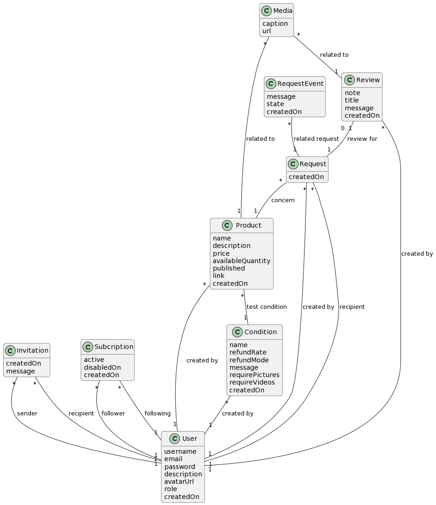

<h1 align="center"> 
Rapport de conception
</h1>  

Vous trouverez ici notre rapport sur nos choix de conception et les différents scripts nécessaires au bon fonctionnement de notre base de données.
  

## **📖 Table des matières**

- [**💡 Conception**](#💡-conception)
- [**📚 Scripts**](#📚-scripts)
    - [**Création de tables**](#création-de-tables)
    - [**Triggers**](#triggers)
    - [**Procédures stockées**](#procédures-stockées)
    - [**Scripts de scénarios**](#scripts-de-scénarios)

# **💡 Conception**

> [Conceptual model est disponible ici.](models/conceptual.puml)

> [Logical model est disponible ici.](models/logical.md)

## **Entités principales**

- `User` : Les utilisateurs de la plateforme ont des attributs tels que leur nom d'utilisateur, leur e-mail, mot de passe, description, l'URL de l'avatar, et leur date d'inscription. 
Un utilisateur est considéré d'office comme un testeur avec le rôle 'user'. Grâce au rôle 'agent', il peut également poster des produits et recevoir des demandes sur la platforme.

- `Invitation` : Un agent peut envoyer une invitation à un testeur ou futur testeur. Si l'email indiquée ne correspond pas à un compte existant, un email est envoyé au testeur afin de l'inviter à s'inscrire. Une fois acceptée, l'invitation se transforme en abonnement.

- `Subscription` : Un abonnement est lié à un utilisateur (testeur) qui suis (follower) un agent. Il aura donc accès à son catalogue tant que son abonnement est actif. Si il est désactivé, on renseigne le champs disabledOn avec la date de désactivation.

- `Request` : Représente les demandes de tests envoyée par un utilisateur (testeur) à un agent. Elle porte sur un produit.

- `RequestEvent` : Représente un événement survenu au sein d'une requête. En plus d'une date et d'un potentiel message, il a plusieurs type d'évènements :
    - Envoyée
    - Acceptée
    - Refusée
    - Reçue
    - Commentée
    - Finalisée
    - Échoué
    - Message *(Permet à l'agent au et testeur de communiquer)*

- `Review` : Représente un avis créé par un testeur. Elle comprend des attributs tels que la note, le titre, le contenu de l'avis et la date de création.

- `Condition` : Représente les conditions associées aux produits à tester. Elle contient des informations telles que le nom de la condition, le taux de remboursement, le mode de remboursement, le message et des indicateurs pour les images et les vidéos requises. Elle est liée à l'utilisateur qui l'a créée.

- `Product` : Elle contient les informations du produit telles que le nom, la description, le prix, la quantité disponible, l'état de publication et le lien vers le produit. Elle est associée à un agent qui l'a créée et à une condition.

- `Media` : Représente les médias (images, vidéos, etc.) liés aux produits et aux avis. Elle contient une légende et une URL vers le média. Elle peut être liée à un produit ou à une critique.

## **Relations**

- `ProductMedia`: Permet d'associer des médias à un produit.

- `ReviewMedia`: Permet d'associer des médias à une critique.

# **📚 Scripts**

## **Création de tables**

> [Le script de création de tables est disponible ici.](scripts/setup/create_tables.sql)

### Contraintes

- Pour créer un `Produit`, une `Condition`, envoyer une `Invitation` ou recevoir une `Request`, vous devrez avoir le rôle `agent`.

- Nous avons ajouté `ON DELETE CASCADE` pour supprimer toutes les données liées à l'`Utilisateur` lorsque nous le supprimons à l'exception de la table `Request` car nous voulons la conserver même si l'Utilisateur est supprimé afin d'en garder une trace.

- Les attributs `createdOn` sont automatiquement remplis avec la date et l'heure actuelles. 

- Concernant les différents ID, nous avons utilisé `AUTO_INCREMENT` pour que l'ID soit automatiquement incrémenté à chaque fois qu'une nouvelle ligne est insérée dans la table.

- On vérifie que le rôle attribué à un utilisateur est soit `agent` soit `user`.

- `ProductMedia` et `ReviewMedia` ont des clés primaires composées, car un produit peut avoir plusieurs médias et une critique peut avoir plusieurs médias. En revanche, une critique ou un produit ne peux pas contenir plusieurs fois le même produit.

## **Insertion des données** 

> [Le script d'insertion de données est disponible ici.](scripts/setup/insert_data.sql)

- Nous avons crée un script d'insertion afin d'avoir une base de données contenant déjà quelques données de test.

## **Triggers**

### Vérification de la disponibilité des produits

Lorsque l'on souhaite créer une demande de test, on vérifie que le produit demandé est toujours disponible : c'est à dire que le nombre de demande acceptés concernant ce produit n'excède pas la quantité disponible en test.

> [Le script est disponible ici.](scripts/triggers/check_product_availability.sql)

## **Procédures stockées**

## Creation de produit et de critiques.

Afin de pouvoir associer des médias à un produit et une critique, nous avons besoin de l'id de l'entité fraichement créé. C'est pour cela que nous avons créer des procédures qui créé l'entité et retourne son ID. 

> [La procédure de création de produit est disponible ici.](scripts/procedures/create_product.sql)
> [La procédure de création de critique est disponible ici.](scripts/procedures/create_review.sql)

## **Scripts de scénarios**

Selon les neufs scénarios que nous avons [écrits dans la cachier des charges](README.md), nous avons créé des scripts pour les exécuter.

> [Les scripts de scénarios sont disponibles ici.](scripts/scenarios/)
